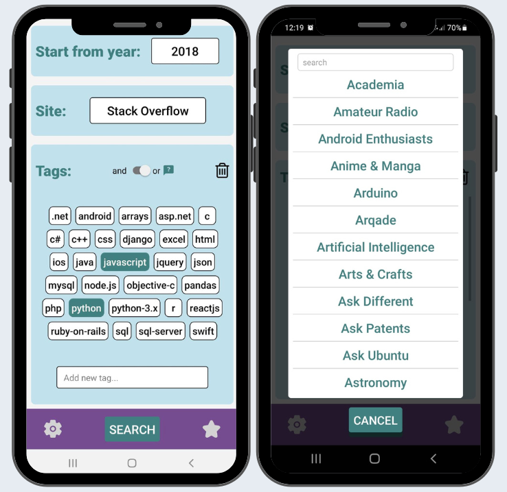

# Stack Explorer

This Android app uses the public Stack Exchange API to explore the content of sites like Stack Overflow, SuperUser and dozens more, in order to find interesting questions and answers about science, languages, technology, history, arts and more.

 

  

 

Select a topic that interest you, choose between the most popular tags or add new ones and tap the search button to start discovering new, interesting and high quality content randomly selected.

 

  

 

Explore the questions and answers and save the most interesting ones to the favorites list to review them later.

## Stack used:

React Native

&nbsp;
  
### Play Store link: 

https://play.google.com/store/apps/details?id=com.github.micpob.stackexplorer

### QR code:

 

  

 

